## GRUPO DE TRABAJO 05

## INTEGRANTES DEL GRUPO
#### Jhohan David Contreras Aragón		1007687796
#### Andrés Felipe Medina Medina 		1015464557
#### Mitchell Elizabeth Rodríguez Barreto	1032503089

## Pregunta 1: 

#### Diseñar el sistema digital de captura de los pixeles de la cámara. No es necesario incluir las señales de control Xclk, pwdn y reset, estas están descritas en el top del proyecto.

El objetivo de este módulo es recibir la información que transmite la cámara (D[7:0], PCLK, VSYNC y HREF) y usarla para crear correctamente un pixel que tenga un tamaño de 8 bits, en formato RGB332, e indicar cuándo y en cuál dirección se debe guardar el pixel en la memoria.
Las variables PCLK, VSYNC y HREF rigen cómo y cuándo se debe guardar la información recibida para la consolidación correcta del pixel en el formato seleccionado. Una breve descripción de cada una de estas señales:  

* CAM_PCLK: Permite que el almacenamiento se realice de manera síncrona, es decir, a la misma velocidad a la que la cámara manda los resultados y así evitando que se pierda información o que se guarde más de una vez un pixel.
* CAM_HREF: Esta variable indica cuando se está transmitiendo la información de una línea de pixeles. 
* CAM_VSYNC: Esta variable indica cuando la cámara empieza a transmitir información al módulo de captura de datos. Como se ve en la imagen, esta señal cuenta con dos flancos, el primero indica el inicio y el segundo el final de la transmisión, permaneciendo apagada en el intermedio. 

La forma en la que la cámara envía las señales PCLK, HREF y el bus de datos es la siguiente:

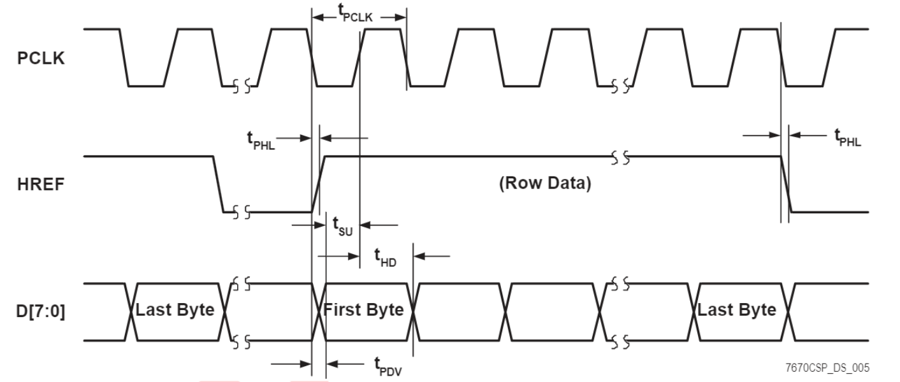

Al observar la señal HREF con respecto a VSYNC, se percibe que hay varios flancos que representan cada una de las filas de la imagen:

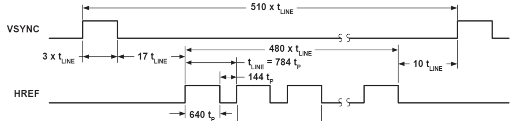

En el código se trabajó con la señal negada con el fin de usarlo como señal de control.  

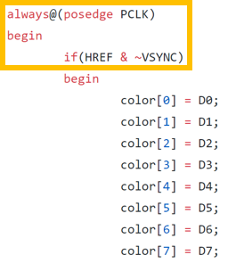

La forma de crear el pixel por medio de downsampling y luego de transmitirlo al buffer de memoria se encuentra descrita en el siguiente punto. 

## Pregunta 2: 

#### Diseñar el downsampler y transmitir la información al buffer de memoria. Recuerde la memoria se ha diseñado para almacenar el pixel en formato RGB332, y almacenar 3 bit para el color Rojo y Verde y 2 bit para el color Azul. Si usted, por ejemplo, selecciona el formato RGB565 de la cámara debe convertir los 5 bit de rojo en 3 bit.
	  
Según las variables de control mencionadas anteriormente lo indiquen, se conformará un pixel de 8 bits y se transmitirá al buffer de memoria. Teniendo en cuenta que el formato que se configuró en la cámara para arrojar la información del pixel es de RGB 565, es necesaria la pasar de este formato a uno RGB 332. Esto se logró por medio de un proceso llamado downsampling, el cual consiste en la reducción del tamaño de la información por medio de la selección o truncamiento de determinados bits. En este caso la forma de realizar el proceso de downsampling fue escogiendo los bits más significativos de cada uno de los colores según corresponda. Por ejemplo, el color rojo (RED) viene en un formato en donde contiene 5 bits y para transformarlo al otro formato en donde sólo cuenta con 3 bits, escogemos únicamente los 3 bits más significativos; para el caso del verde (GREEN) y del azul (BLUE) escogemos los 3 y 2 bits más significativos correspondientemente.

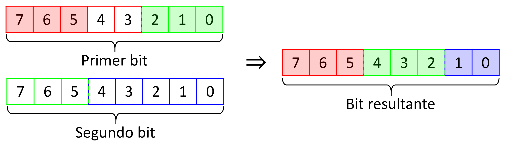

Para ello se crearon variables auxiliares internas:

* *Color[7:0]* almacenarán los 8 bits enviados por la cámara, en donde el más significativo es el que está en la posición 7 y el menos en la 0. 
* *DP_RAM_addr_in* es la dirección del espacio de memoria que ocupará la información recibida. Es una variable de 15 bits que irá incrementando en 1 su valor por cada pixel almacenado.
* *DP_RAM_data_in* son los datos que se guardaran en la memoria, cada uno correspondiente a un pixel de la imagen, se actualiza cada dos flancos de subida de la señal PCLK.
* *cont* es una variable interna de un bit que determina si la información que ha sido recibida pertenece a un HIGH byte o a un LOW byte. De ser contador igual a 0, se guardan los bits 0, 2, 3, 5, 6 y 7 como los primeros 6 bits del DP_RAM_data_in, y si contador es igual a 1 se toman los bits 3 y 4 y se almacenarán en los 2 últimos bites de DP_RAM_data_in. Al final de esta operación contador incrementará su valor en 1 y, al ser un número binario, su valor oscilará entre
0 y 1. 
* *DP_RAM_regW* es la variable que indica cuando se puede almacenar DP_RAM_data_in en la memoria RAM. Es igual a 1 cuando se han guardado los 8 bits en DP_RAM_data_in y 0 en caso contrario.

Para el proceso de transmisión de la información siempre está ocurriendo, así el pixel esté terminado o no, pero la forma de evitar que se guarde un pixel erróneo es por medio de la variable DP_RAM_regW ya que esta solo es igual a 1 cuando el pixel está totalmente formado y 0 en caso contrario. 

Materializando lo mencionado anteriormente en el punto 1 y 2 en la descripción del hardware, en tiene:

Primero se declaran las entradas y salidas del módulo, al igual que las variables internas.

Luego se crea un condicional dependiente del reloj, PCLK, e internamente se hace otro pero con las variables ~VSYNC y HREF. 

Se puede ver que una vez las 3 señales estén en HIGH, se tomarán los valores de la entrada D y se almacenarán en la variable interna color. Como se había dicho anteriormente, cuando cont sea igual a 0 ó a 1 se guardarán los bits más significativos de cada color, según corresponda, en la variable
DP_RAM_data_in, que es la que contiene el valor del pixel final. Una vez se hace este procedimiento y ha terminado, contador aumenta en uno su valor. 

Luego, para ir actualizando la posición de la memoria en dónde se guardará el pixel se utiliza el flanco de bajada (*negedge*) de la señal PCLK y los flancos de subida (*posedge*) ~VSYNC y HREF que antes, que ambas estén en HIGH, para aumentar en uno su posición e ir guardando ordenadamente los pixeles. Esto se hace para que el incremento se genere después del almacenamiento del pixel en DP_RAM_data_in; y además, evitar que la posición 0 de la RAM quede vacía.

El diagrama funcional es el siguiente:

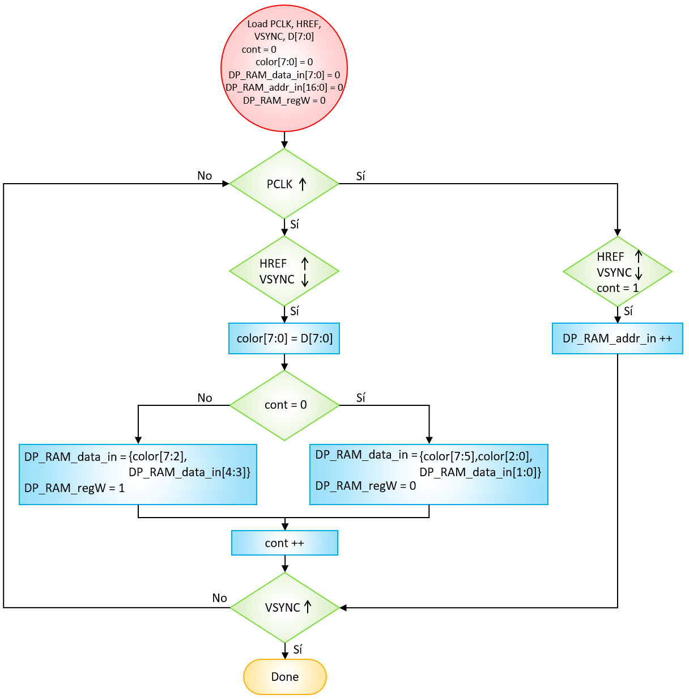

El diagrama estructural:

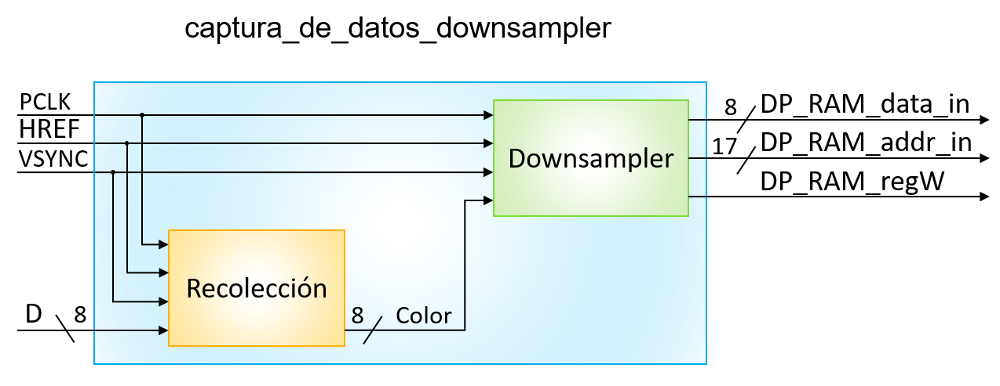

## Pregunta 3: 

#### Revisar si el bloque PLL, clk_32MHZ_to_25M_24M.v (diagrama azul de la figura 1), propuesto en el bloque test_cam.v, cumple con las necesidades de reloj de entrada y salida para la plataforma utilizada. Recuerde el sistema requiere además de los 32, 50 o 100 Mhz de entrada, generar dos señales de reloj de 25Mhz y 24 Mhz para la pantalla VGA y la Cámara respectivamente. En este sentido, el archivo clk_32MHZ_to_25M_24M.v se encuentran en el interior de la carpeta hdl/scr/PLL, se debe modificar.

Se hizo la actualización del archivo "clk_32MHZ_to_25M_24M.v" de acuerdo a las especificaciones de la FPGA Nexys 4DDR. El archivo nuevo "cl_25_24.v" está en la carpeta /hdl/src/PLL/cl_25_24.v

En las siguientes imágenes se encuentra el paso a paso de cómo se creó el nuevo PLL con Clocking Wizard.

1) Una vez tenemos el proyecto abierto en ISE vamos a tools -> Core Generator. 

2) Luego le damos doble click a "view by name" y buscamos "Clock Wizard". 

3) Después de unos segundos se abrirá el panel de control de Clock Wizard, en donde el único cambio a realizar es en la casilla de "Source", seleccionamos la opción "Global Buffer", observamos que “Input Freq (MHz) – Value” esté en 100,000 y le damos continuar.

4) Ahora ingresamos las frecuencias de los dos relojes de salida que queremos. Primero se cambia el valor de la casilla "Output Freq (MHz) - Requested" de "CLK_OUT1" por 24,000. Para la segunda frecuencia del reloj activamos primero el reloj 2 dándole clic en la casilla frente a "CLK_OUT2" e ingresando la frecuencia deseada, en este caso 25,000. Sin cambiar nada más, le damos clic a Next.

5) En las 3 ventanas siguientes daremos next. 

Observamos que los valores ingresados sean correctos.

6) En esta última ventana damos click en "Generate" y esperamos que el programa genere el código.

Después de esto se busca el archivo en la carpeta /hdl/ipcore_dir y se reemplaza en la carpeta /hdl/src/PLL, teniendo cuidado de también reemplazar el nombre del módulo en test_cam.v.

## Pregunta 4: 

#### Modificar el módulo test_cam.v para agregar las señales de entrada y salida necesarias para la cámara (señales amarillas del diagrama).

En la imagen del código actualizado (que se encuentra en /hdl/src/test_cam.v) se puede ver que entre las líneas 37 y 47 se declararon las salidas de la cámara. 
* Las variables CAM_D0, CAM_D1, CAM_D2, CAM_D3, CAM_D4, CAM_D5, CAM_D6 y CAM_D7 almacenan los 8 bits del bus de datos dado por la cámara.
* CAM_PCLK 
* CAM_HREF
* CAM_VSYNC

## Pregunta 5: 

#### Instanciar el módulo diseñado en el hito 1 y 2 en el módulo test_cam.v.

Para instanciar se llamó el módulo diseñado *captura_de_datos_downsampler.v* y se asignó el nombre de *Capture_Downsampler*, luego se ajustaron las salidas de la cámara a las entradas del módulo de captura de datos, al igual que las salidas de este módulo son las entradas del módulo buffer_ram_dp.v.

El diagrama estructural de la cámara, adicionando el módulo diseñado y los nombres de las señales faltantes queda así:

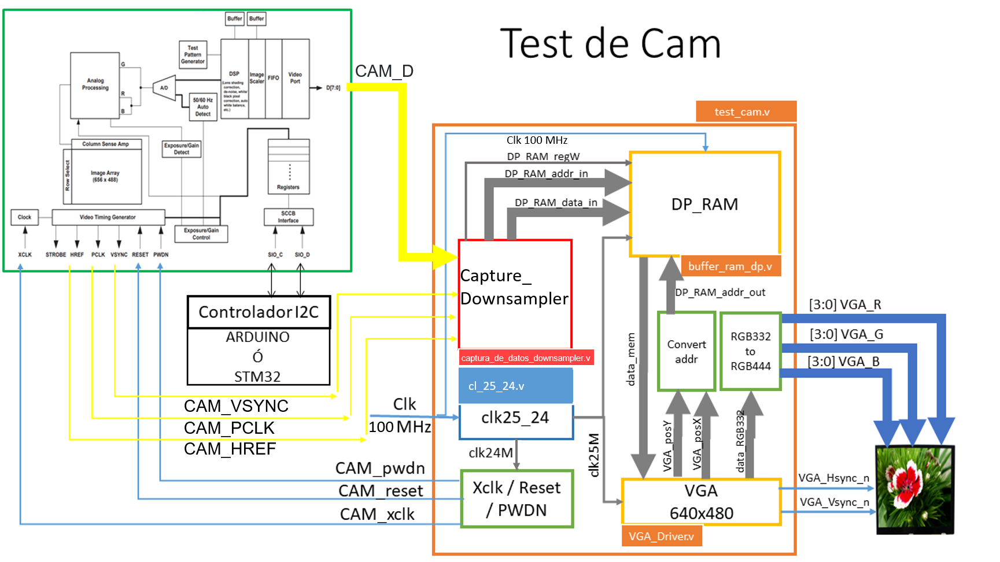

## Pregunta 6: 
#### Implementar el proyecto completo y documentar los resultados. Recuerde adicionar el nombre de las señales y módulos en la figura 1 y registre el cambio en el archivo README.md

Se inició por probar la transmisión de datos desde la memoria a la pantalla, para eso se pasó el programa a la FGPA, se conectó a una pantalla por medio del puerto VGA pero no se conectó con la cámara. Se tomó provecho de la configuración inicial de la memoria, en donde los datos iniciales se leen del archivo image.men, y se observó que efectivamente se muestra el patrón geométrico correctamente. (El archivo image.men actualizado ahora contiene los códigos de los colores en sistema hexadecimal E0, que corresponde al color rojo, y 97, que corresponde al color azul claro, distribuidos de tal manera para que se observe en la pantalla franjas horizontales delgadas por cada color). En la imagen siguiente se ve el resultado obtenido.

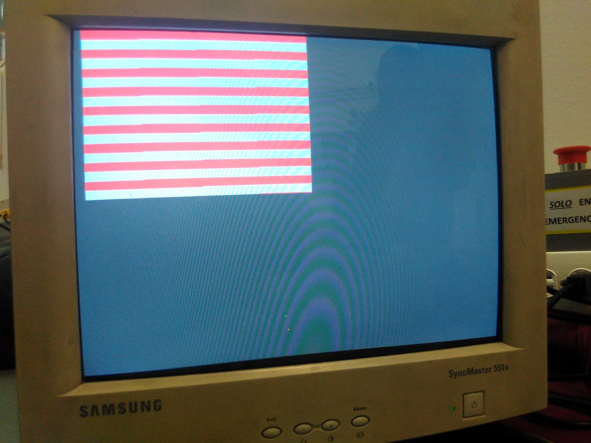

Luego se probó la conexión con la cámara

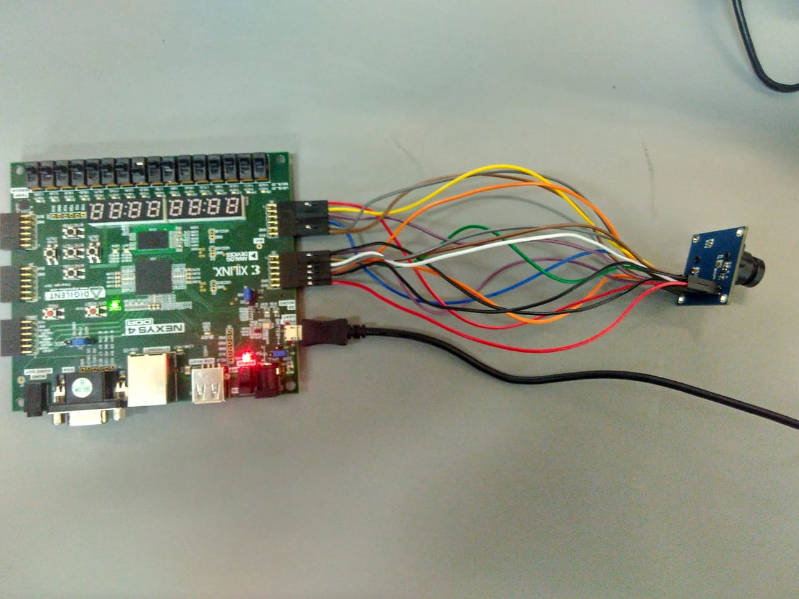

Se hizo la transmisión de los datos pero lastimosamente la visualización es la siguiente

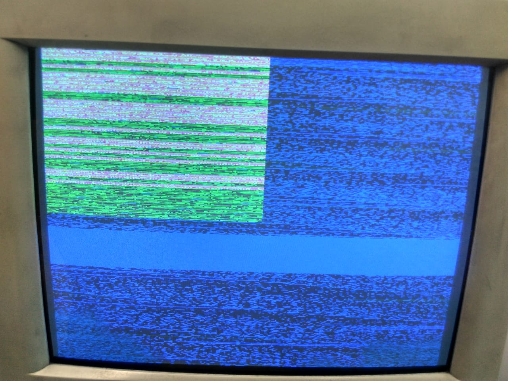

El último resultado obtenido fue:

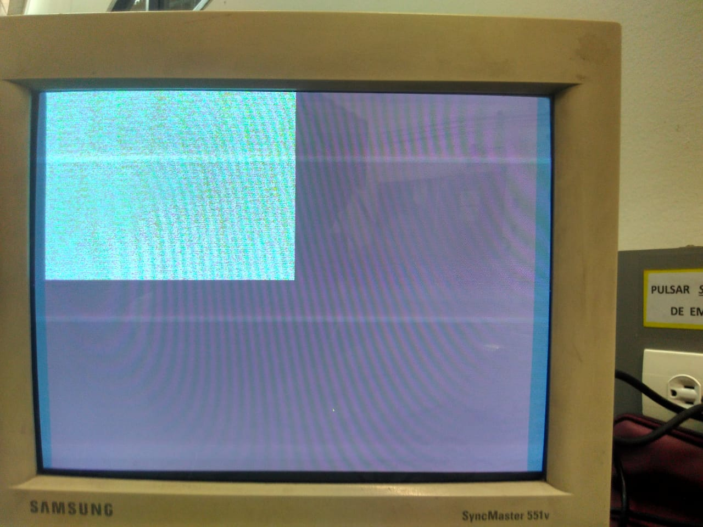

### Implementación
#### Al culminar los hitos anteriores deben:

#### Crear el archivo UCF.

En el archivo UCF se declararon las entradas y salidas necesarias del módulo test_cam.v. Se empezó por declarar el clk según lo indica el UCF Master y rst se unió a un botón. Luego se escribió la línea siguiente de código que indica que la señal "CAM_PCLK" no es un reloj que se genera dentro de la tarjeta sino que es una señal de entrada. 

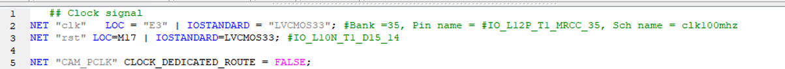

Se declararan las salidas del puerto VGA: los puertos para el pixel; que son 12 debido a que la pantalla recibe formato RGB 444; otro puerto para VGA_Hsync_n y otro para VGA_Vsync_n. 

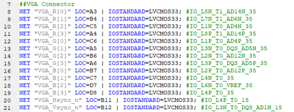

Por último se declaran las variables relacionadas con la cámara, estas son CAM_PCLK, CAM_HREF, CAM_VSYNC y los 8 valores correspondientes al bus de datos (CAM_D0 - CAM_D7). 

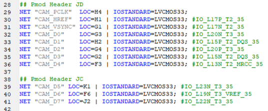

#### Realizar el test de la pantalla. Programar la FPGA con el bitstream del proyecto y no conectar la cámara. ¿Qué espera visualizar?, ¿Es correcto este resultado?

Al no conectar la cámara los datos que se muestran en pantalla son los almacenados en la memoria inicialmente desde el archivo image.men, por ende, cuando se inicie la transmisión de datos desde la memoria a la pantalla VGA se espera observar líneas horizontales de dos colores, rojo y azul claro, alternadas, tal y como se definió en el archivo; se seleccionó el cambio de colores con el fin de observar con mayor claridad el funcionamiento de la memoria RAM. En la siguiente imagen se ve que el resultado esperado es correcto.

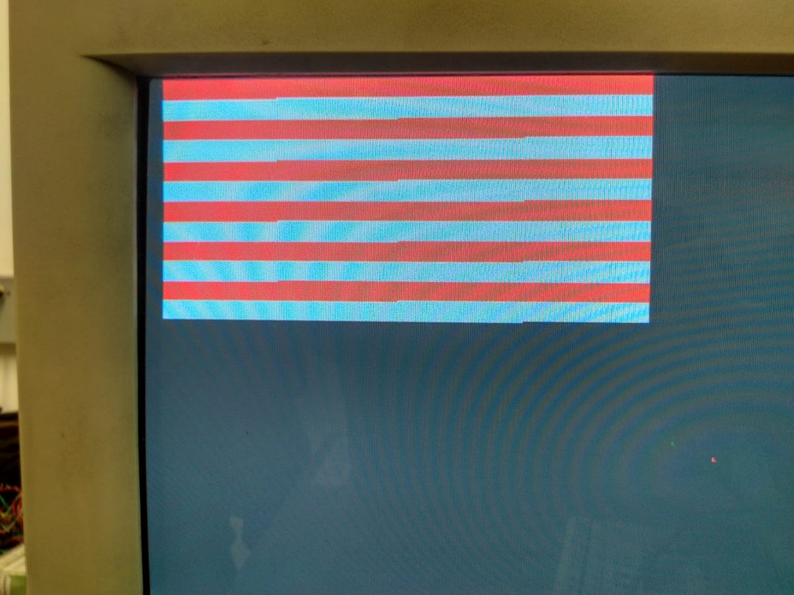

#### Configure la cámara en test por medio del bus I2C con ayuda de Arduino. ¿Es correcto el resultado? ¿Cada cuánto se refresca el buffer de memoria?

Según las especificaciones de la cámara, esta es capaz de enviar 30 cuadros por segundo y debido a la configuración seleccionada anteriormente, el tamaño de la ventana es de 320 x2 40 pixeles, se tiene que cada 33.3 ms la cámara envía 76.800 pixeles. Esto es en el caso de que se use como cámara de video, en donde la transmisión de datos entre los módulos es constante, para configurar con ayuda del arduino las salidas de la cámara utilizamos las definiciones que da el entorno de arduino para configurar las salidas COM de acuerdo a los requerimientos trabajados en la parte 01 del trabajo de proyecto, así lo primero que se configura es el tamaño de imagen usando COM04 con el número 0D que permite cambiar el tamaño de la imagen de salida a 1/2 de la ventana que es de tamaño de 320 x 240 pixeles.

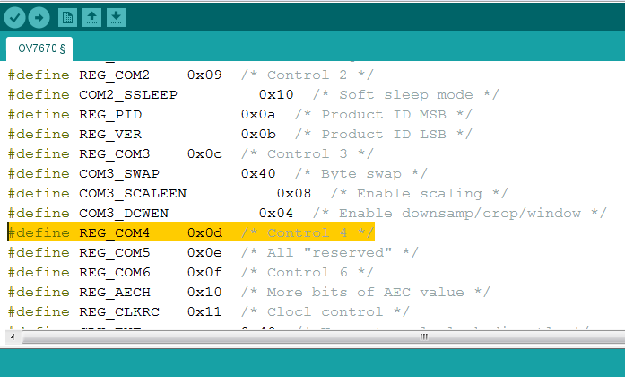

Los siguientes parámetros que se configuran con el COM07 son los que se habilitan la franja de colores, habilita los formatos de salida para poder elegirlos y reinicia los registros, para esto se configura con el número 12, este número en hexadecimal representa dos distribuciones de bits ya que el COM trabaja con 8 bits para configurarlo.

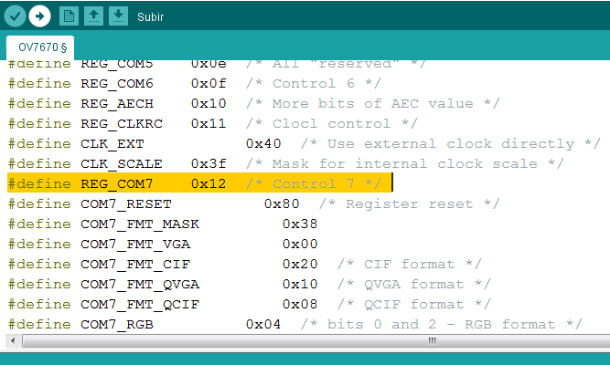

El parámetro que configura el tamaño y el formato del pixel es el del COM15 que configura el formato de salida del pixel de la cámara a un formato RGB 565 esto se logra ingresando el número 40. 

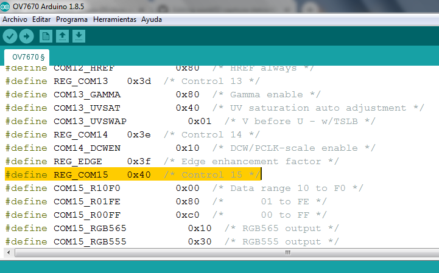

El resto de parámetros ingresados son por defecto de la cámara, estos tienen desactivado el test de colores de la cámara más este se puede configurar con el COM17 ingresando el número 42 y agregando el parametro  SCALING_XSC con el número 70 para lineas horizontales y SCALING_YSC con el número 71 para lineas verticales.

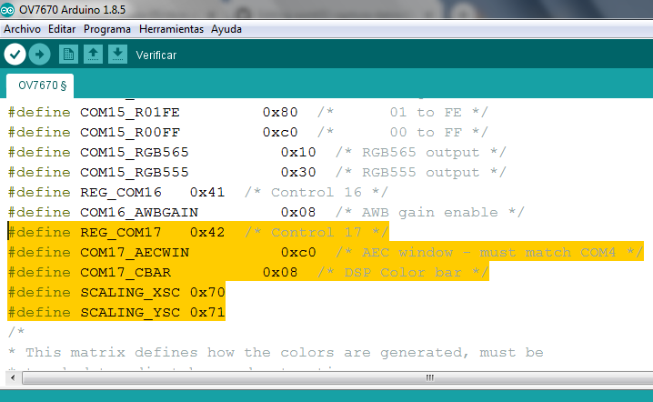

Subiendo este código al arduino uno y conectando la cámara a este de la siguiente manera: 

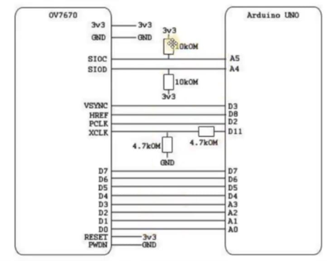

Configuramos así el I2C y el funcionamiento de la cámara.

#### ¿Qué falta implementar para tener el control de la toma de fotos?

Para cambiar su funcionamiento al de una cámara fotográfica es necesario agregar una señal de control adicional, la cual se usaría para determinar el instante en el cual queremos que un arreglo de pixeles se muestre en la pantalla cuando nosotros queramos. Esto se logra incluyendo un botón que determine el instante en el que el módulo recibe la información de un sólo frame de la cámara y la manda a la memoria para que sea mostrado en la pantalla. Este frame guardado permanecerá almacenado y exhibido en la pantalla hasta que se sea reemplazado por un nuevo frame al presionar el botón. 

