## Integrantes: 

Mitchell Elizabeth Rodríguez Barreto
Jhohan David Contreras Aragón
Andrés Felipe Medina Medina

### Pregunta 1: Diseñar el sistema digital de captura de los pixeles de la cámara. No es necesario incluir las señales de control Xclk, pwdn y reset, estas están descritas en el top del proyecto.

El objetivo de este módulo es recibir la información que transmite la cámara (D[7:0], PCLK, VSYNC y HREF) y usarla para crear correctamente un pixel que tenga un tamaño de 8 bits, ya que está en formato RGB332, e indicar cuándo y en cuál dirección de memoria se debe guardar el pixel en la memoria.
Las variables PCLK, VSYNC y HREF rigen cómo y cuando se debe guardar la información recibida para la consolidación correcta del pixel en el formato seleccionado. Una breve descripción de cada una de estas señales:  

* CAM_PCLK: Permite que el almacenamiento se realice de manera síncrona, es decir, a la misma velocidad a la que la cámara manda los resultados y así evitando que se pierda información o que se guarde más de una vez un pixel.
* CAM_VSYNC: Esta variable indica cuando la cámara empieza a transmitir información al módulo de captura de datos. Como se ve en la imagen, esta señal cuenta con dos flancos, el primero indica el inicio y el segundo el final de la transmisión, permaneciendo apagada en el intermedio. 
**Agregar imagen**  En el código se trabajó con la señal negada con el fin de usarlo como señal de control.  
* CAM_HREF: Esta variable indica cuando se está transmitiendo la información de una línea de pixeles. 

**Agregar imagen del código**

La forma de crear el pixel por medio de downsampling y luego de transmitirlo al buffer de memoria se encuentra descrita en el siguiente punto. 

### Pregunta 2: Diseñar el downsampler y transmitir la información al buffer de memoria. Recuerde la memoria se ha diseñado para almacenar el pixel en formato RGB332, y almacenar 3 bit para el color Rojo y Verde y 2 bit para el color Azul. Si usted, por ejemplo, 
selecciona el formato RGB565 de la cámara debe convertir los 5 bit de rojo en 3 bit.
	  
Según las variables de control mencionadas anteriormente lo indiquen, se conformará un pixel de 8 bits y se transmitirá al buffer de memoria. Teniendo en cuenta que el formato que se configuró en la cámara para arrojar la información del pixel es de RGB 565, es necesaria la transformación
de este formato a uno RGB 332. Esto se logró por medio de un proceso llamado downsampling, el cual consiste en la reduccion del tamaño de la información por medio de la selección o truncamiento de determinados bits. En este caso la forma de realizar el proceso de downsampling fue escogiendo 
los bits más significativos de cada uno de los colores según corresponda. Por ejemplo, el color RED viene en un formato en donde contiene 5 bits y para transformarlo al otro formato en donde sólo cuenta con 3 bits, escogemos únicamente los 3 bits más significativos; para el caso del GREEN y del BLUE escomgemos los
3 y 2 bits más significativos correspondientemente. Para ello se crearon variables axiliares internas:

* Color[7:0] almacenarán los 8 bits enviados por la cámara, en donde el más significativo es el que está en la posición 7 y el menos en la 0. 
* data_in es la dirección del espacio de memoria que ocupará la información recibida. Es una variable de 15 bites que irá incrementando en 1 su valor por cada pixel almacenado.
* cont es una variable interna de un bit que determina si la información que ha sido recibida pertenece a un HIGH byte o a un LOW Byte. De ser contador igual a 0, se guardan los bites 1, 2, 3, 5, 6 y 7
como los primeros 6 bites del Data_in, y si contador es igual a 1 se toman los bites 3 y 4 y se almacenarán en los 2 últimos bites de Data_in. Al final de esta operación contador incrementará su valor en 1 y, al ser un número binario, su valor oscilará entre
0 y 1. 
* DP_RAM_regW es la variable que indica cuando se puede almacenar Data_in en la memoria RAM. Es igual a 1 cuando se han guardado los 8 bites en Data_in y 0 en caso contrario.

Para el proceso de transmisión de la información siempre esta ocurriendo, así el pixel esté terminado o no, pero la forma de evitar que se guarde un pixel erróneo es por medio de la variable DP_RAM_regW ya que esta solo es igual a 1 cuando el pixel está totalmente
formado y 0 en caso contrario. 

Materializando lo mencionado anteriormente en el punto 1 y 2 en código, en tiene:

Primero es la declaración de las entradas y salidas del módulo, al igual que las variables internas.

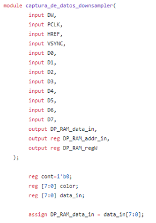

Luego se crea un condicional dependiente del reloj del reloj, CAM_PCLK, e internamente se hace otro pero con las variables ~CAM_VSYNC y CAM_HREF. 

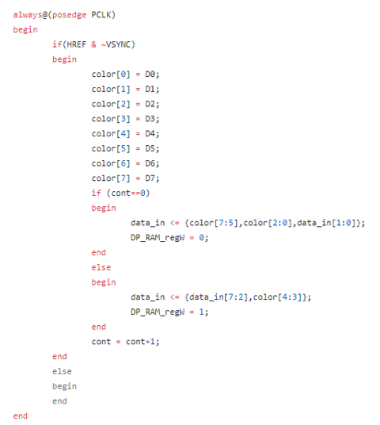

Se puede ver que una vez las 3 señales esten en HIGH, se tomarán los valores de la entrada D y se almacenarán en la variable interna color. Cuando cont sea igual a 0 ó a 1 se guardarán los bits más significativos de cada color, según corresponda, en la variable
data_in, que es la que contiene el valor del pixel final. Una vez se hizo este procedimiento ha terminado, contador aumenta en uno su valor. 

Luego, para ir actualizando la posición de la memoria en dónde se guardará el pixel se utiliza el flanco de bajada de la señal CAM_PCLK y las mismas condiciones para ~CAM_VSYNC y CAM_HREF que antes, que ambas estén en HIGH, para aumentar en uno su posición e ir guardando 
ordenadamente los pixeles. Esto se hace para evitar errores en cuanto a ...

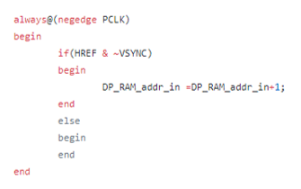

**Agregar diagramas funcionales y estructurales 

### Pregunta 3: Revisar si el bloque PLL, clk_32MHZ_to_25M_24M.v (diagrama azul de la figura 1), propuesto en el bloque test_cam.v, cumple con las necesidades de reloj de entrada y salida para la plataforma utilizada. 
Recuerde el sistema requiere además de los 32, 50 o 100 Mhz de entrada, generar dos señales de reloj de 25Mhz y 24 Mhz para la pantalla VGA y la Cámara respectivamente. En este sentido, el archivo clk_32MHZ_to_25M_24M.v 
se encuentran en el interior de la carpeta hdl/scr/PLL, se debe modificar.

Se hizo la actualización del archivo "clk_32MHZ_to_25M_24M.v" de acuerdo a las especificaciones de la FPGA Nexys 4DDR. El código nuevo está en la carpeta "cl_25_24.v" y se puede ver en /hdl/src/PLL/cl_25_24.v

En las siguientes imagenes se encuentra el paso a paso de cómo se creó el nuevo PLL con Clocking Wizard.

1) Una vez tenemos el proyecto abierto en ISE vamos a tools -> Core Generator. 

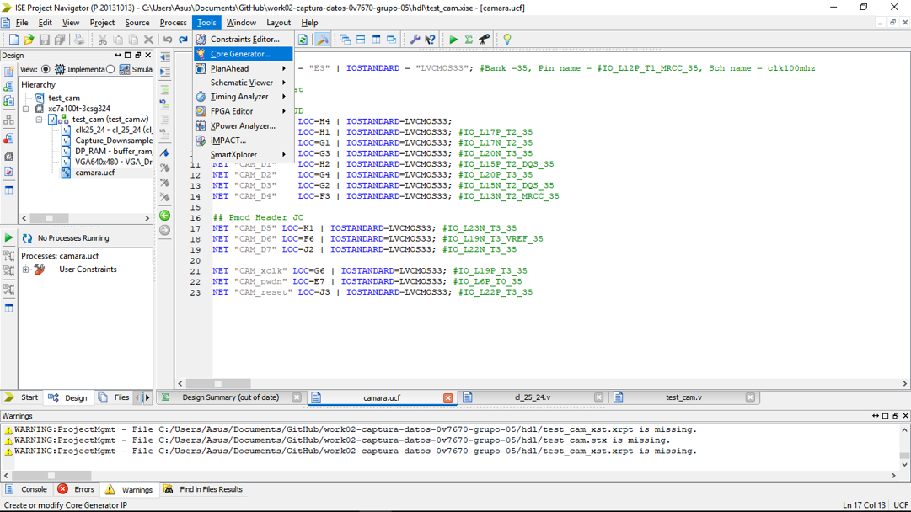

2) Luego le damos doble click a "view by name" y buscamos "Clock Wizard". 

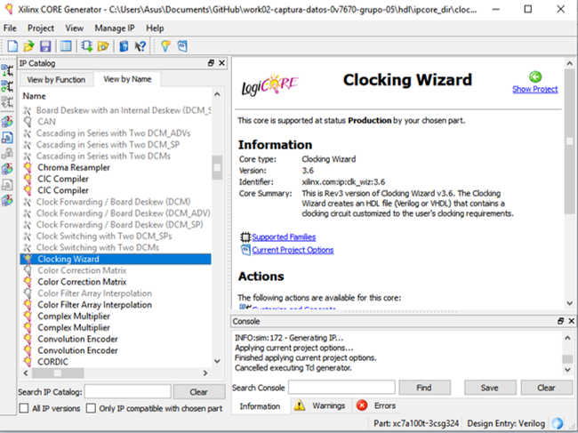

3) Después de unos segundos se abrirá el panel de control de Clock Wizard, en donde el único cambio a realizar es en la casilla de "Source", seleccionamos la opcion "Global Buffer" y le damos continuar.

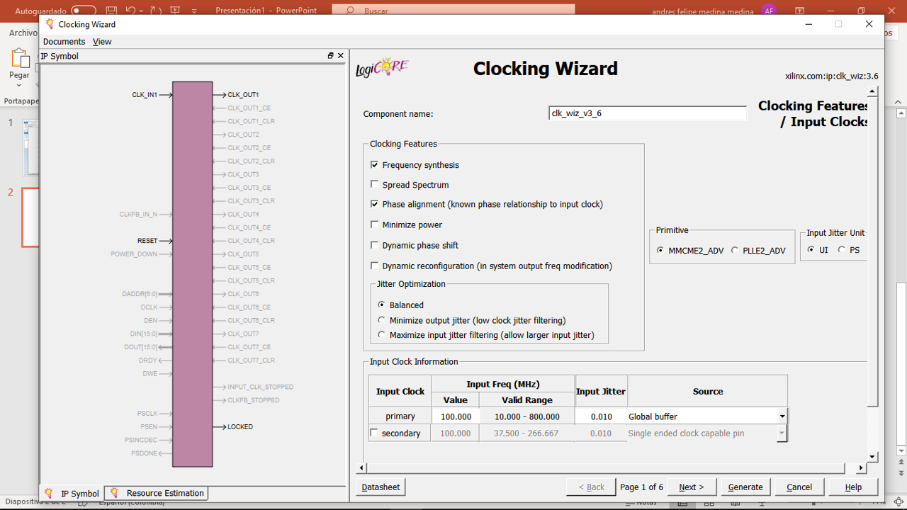

4) Ahora ingresamos las frecuencias de los dos relojes de salida que queremos. Primero se cambia el valor de la casilla "Output Freq (MHz) - Requested" de "CLK_OUT1" por 24.000. Para la segunda frecuencia del reloj activamos primero
el reloj 2 dándole click en la casilla frente a "CLK_OUT2" e ingresando la frecuencia deseada, en este caso 25.000. SIn cambiar nada más, le damos click a Next.

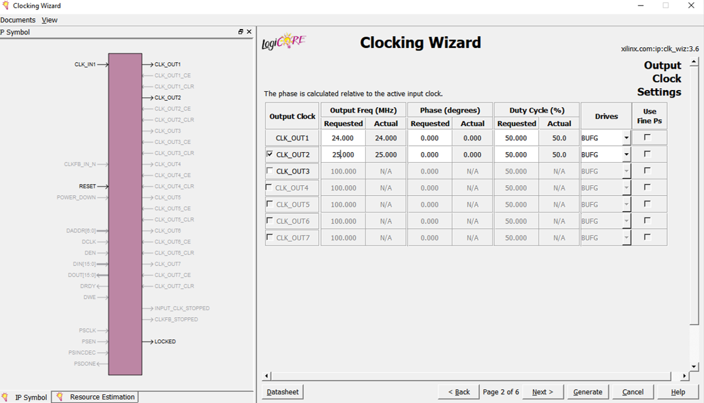

5) En las 3 ventanas siguientes daremos next. 

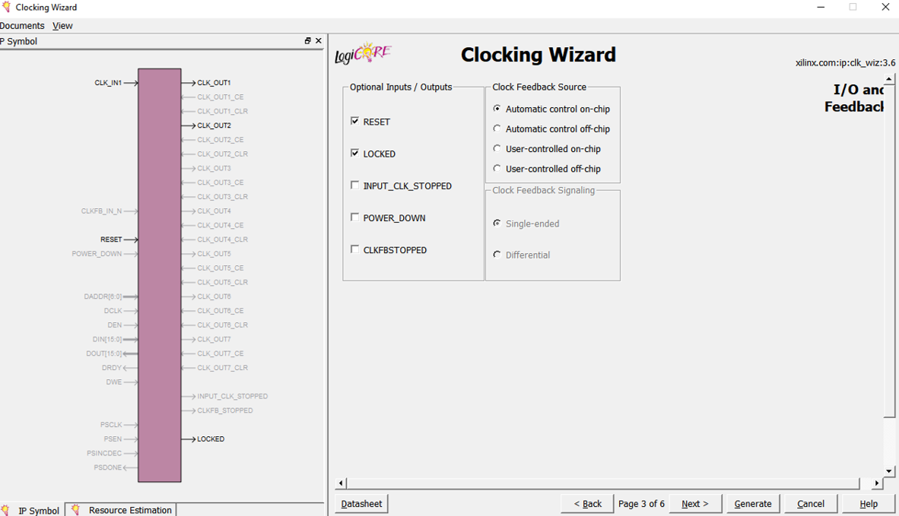
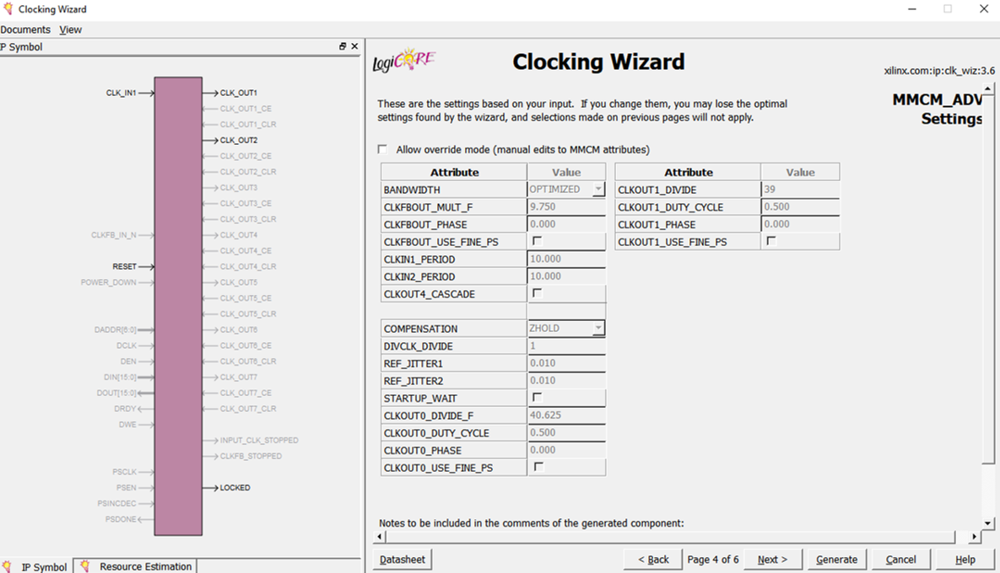
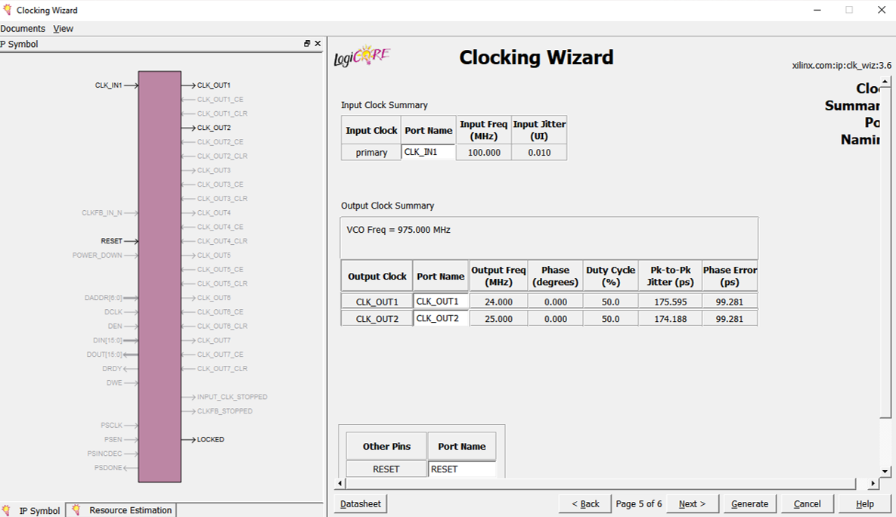

6) En esta última ventana damos click en "Generate" y esperamos que el programa genere el código.

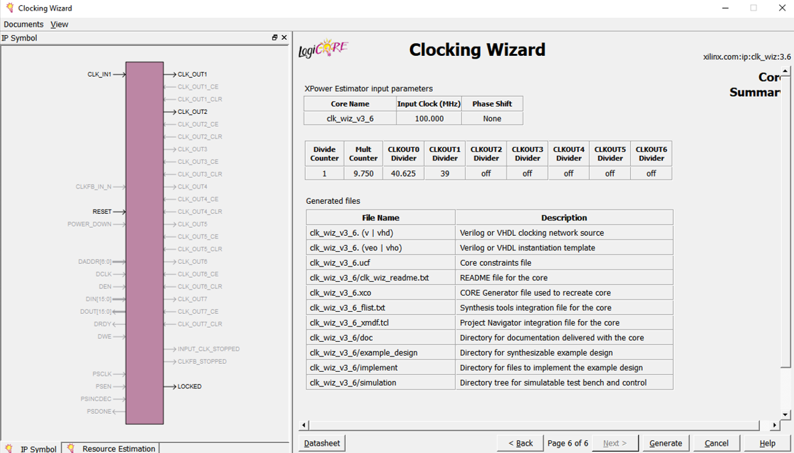

### Pregunta 4: Modificar el módulo test_cam.v para agregar las señales de entrada y salida necesarias para la cámara (señales amarillas del diagrama).

En la imagen del código actualizado (que se encuentra en /hdl/src/test_cam.v) se puede ver que entre las líneas 37 y 47 se declararon las salidas de la cámara. 
* Las variables CAM_D0, CAM_D1, CAM_D2, CAM_D3, CAM_D4, CAM_D5, CAM_D6 y CAM_D7 almacenan los 8 bits de los buses de datos dados por la cámara.
* CAM_PCLK 
* CAM_HREF
* CAM_VSYNC

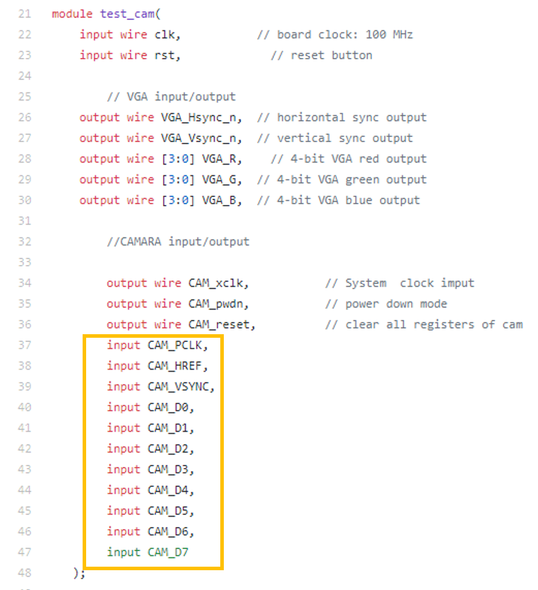

### Pregunta 5: Instanciar el módulo diseñado en el hito 1 y 2 en el módulo test_cam.v.

Nuestro código ejecuta estas operaciones dentro del mismo módulo. Cómo estos ya se explicaron en la pregunta 1 y 2, se explicará como se acopló este módulo al módulo general test_cam.v.

En la siguiente imagen se ve como se ajustan las salidas de la cámara a las entradas del módulo de captura de datos al igual que como las salidas de este módulo son las entradas del módulo buffer_ram_dp.v.

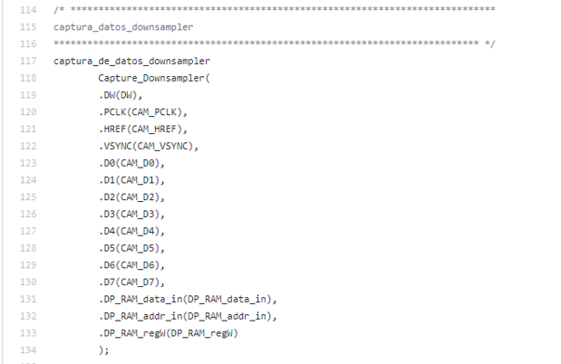

### Pregunta 6: Implementar el proyecto completo y documentar los resultados. Recuerde adicionar el nombre de las señales y módulos en la figura 1 y registre el cambio en el archivo README.md 
  

